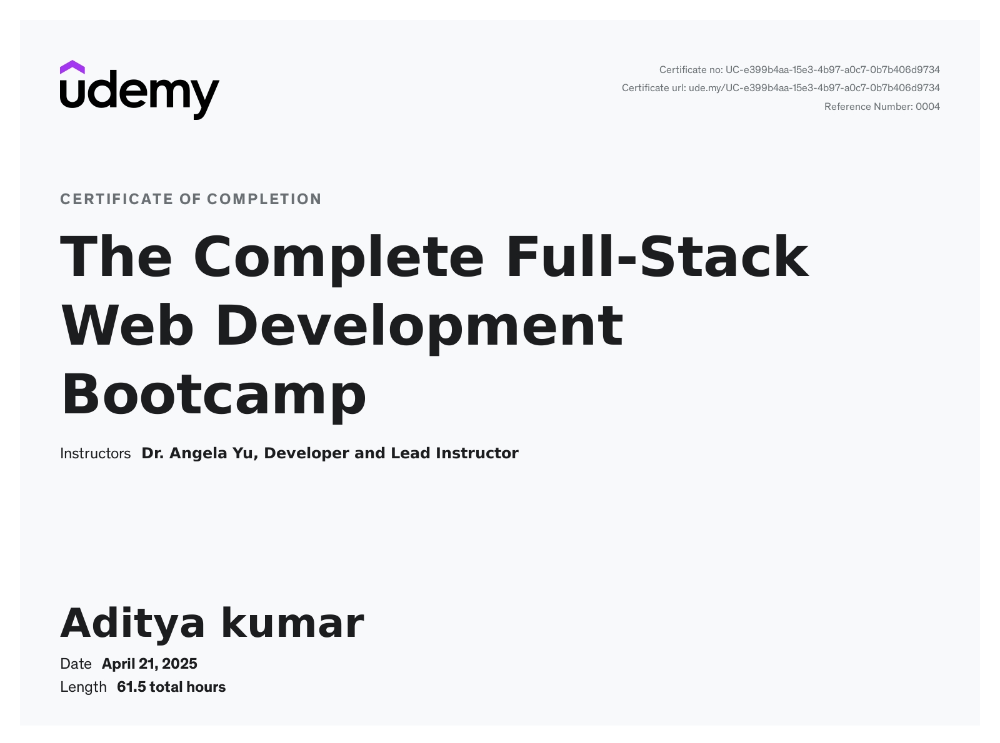

  

  

  
  
  
  
  
  
  
  

  📫 <b>adityakumarnhce@gmail.com</b> &nbsp;|&nbsp; 🌐 <a href="https://adityakrportfolio.vercel.app/">Portfolio</a> &nbsp;|&nbsp; 📍 Bengaluru, India

---

## 👋 About Me

I'm a Software Engineering student (B.E. Computer Science – Data Science, CGPA 9.22) with a strong backend and data-first mindset. I design scalable APIs, work across Python/SQL for data cleaning and analysis, and enjoy applying core CS fundamentals to build reliable, data-driven systems. I've shipped full-stack AI/ML products end-to-end and recently interned building a full-scale Electronics PLM system.

- 🔭 **Currently building:** [InfraMind](https://github.com/Adityarish) — an AI-powered IT infrastructure management platform (n8n + Neo4j + FastAPI + ServiceNow)
- 🌱 **Currently exploring:** Agentic AI, PowerBi and System Design
- 👯 **Open to collaborating on:** AI-powered backend systems & real-time applications
- ⚡ **Fun fact:** I count sheep to fall asleep — and then square them.

---

## 💼 Experience

**Software Developer Intern** · forUdyog, Kolkata, India · *Feb 2026 – May 2026*
Built a full-stack Electronics PLM system in React with database integration — covering Projects, Versions, BOM, inventory, supplier/quotation management, and production workflows.

---

## 🚀 Featured Projects

<table>
<tr>
<td width="50%">

### 🏋️ LockedIn — AI Fitness Platform
Real-time posture correction using computer vision. Tracks 10+ body landmarks with MediaPipe for accurate rep counting, on a microservices architecture (React + Node.js + Python AI service).

`Python` `OpenCV` `MediaPipe` `React` `Node.js`

[🔗 Repository](https://github.com/ImAust1n/Locked.in.git)

</td>
<td width="50%">

### 🎙️ Yappy — Low-Latency Speech-to-Text
Fully offline, real-time transcription using faster-whisper, with a multi-threaded pipeline for 16kHz audio and a Chrome Extension for injecting text into any input field.

`Python` `FastAPI` `Whisper` `Chrome Extension`

[🔗 Repository](https://github.com/Adityarish/YapYap)

</td>
</tr>
<tr>
<td width="50%">

### 📄 Python RAG System
Retrieval-Augmented Generation system for Q&A over custom documents — semantic search over 384-dim embeddings via FAISS, grounding LLM responses in retrieved context.

`Python` `Flask` `FAISS` `NLP`

[🔗 Repository](https://github.com/Adityarish/RAG)

</td>
<td width="50%">

### 🧠 InfraMind — AI Infra Management *(in progress)*
AI-powered IT infrastructure platform with CMDB ingestion, a natural-language what-if scenario simulator, and an AI CAB Co-Pilot for change management.

`n8n` `Neo4j` `Gemini` `GPT-4o` `FastAPI` `ServiceNow`

[🔗 Repository](https://github.com/Adityarish)

</td>
</tr>
</table>

---

## 🛠️ Tech Stack

<h4>Languages</h4>

  
  
  
  
  

<h4>Frontend</h4>

  
  
  
  
  

<h4>Backend & Automation</h4>

  
  
  
  

<h4>Databases</h4>

  
  
  

<h4>Data Analysis & ML</h4>

  
  
  
  

<h4>Tools</h4>

  
  
  

---

## 🏆 Achievements

<h3>🥇 Hackathon Wins</h3>

  

    <!-- Replace src below with your own image path once uploaded, e.g. ./assets/achievements/code-battle.png -->
    
    
  

  

    🥈 <b>2nd Prize — Code Battle 2k25</b> (National Hackathon, VDRIT × IEEE, March 2025) 
    🥉 <b>3rd Prize — Code Breaker Challenge 2.0</b> (National Hackathon, GAT Bengaluru, May 2025)
  

<h3>📜 Certifications</h3>

  

    <!-- Replace src below with your own certificate image once uploaded -->
    
    
    
  

  

    <b>The Complete Python Pro Bootcamp</b> — Udemy 
    <b>Mastering Data Structures and Algorithms using C/C++</b> — Udemy
  

<h3>🗂 More Certificates & Diplomas</h3>

  

    <!-- Add more placeholders here as you send over additional achievements -->
    
  

---

## 📊 GitHub Stats

  
  

  

  

